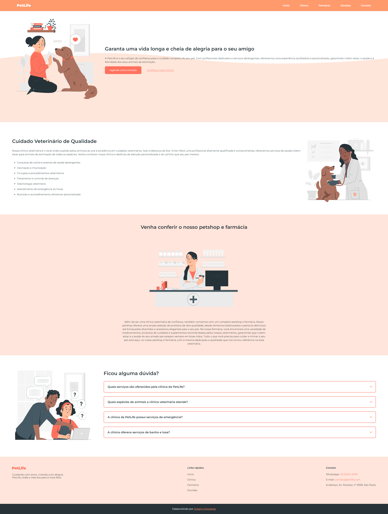

<h1 align="center"> PetLife </h1>

Projeto desenvolvido em parceria com a 
<a href="https://www.onebitcode.com">One Bit Code</a>

  <a href="#-projeto">Projeto</a>&nbsp;&nbsp;&nbsp;|&nbsp;&nbsp;&nbsp;
  <a href="#-tecnologias">Tecnologias</a>

  

## 💻 Projeto

O PetLife é uma clinica veterinária.

- [Acesse o projeto finalizado, online](https://jurx23.github.io/petlife)

## 🚀 Tecnologias

Esse projeto foi desenvolvido com as seguintes tecnologias e ferramentas:

- HTML 5
- CSS 3
- JavaScript
- Git
- Github
- Visual Studio Code